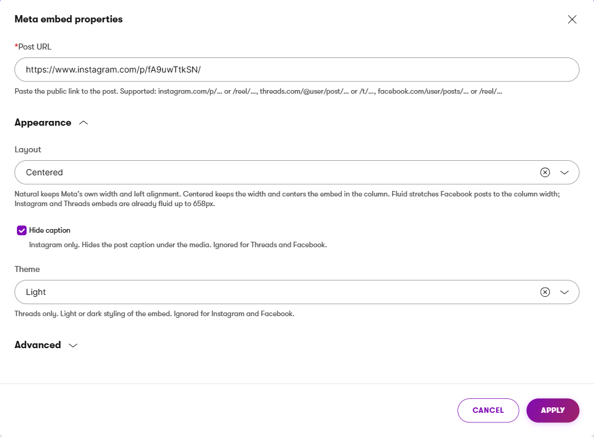

# Meta embeds for Xperience by Kentico

[](https://github.com/Koukovistas/xperience-community-meta-embeds/actions/workflows/ci.yml)
[](https://www.nuget.org/packages/XperienceCommunity.MetaEmbeds)

Paste a public Threads, Instagram or Facebook post URL into a Page Builder widget. Tokenless, cached, sanitised.
No Meta app, no App Review, no configuration.

This is a community package (`XperienceCommunity.*`), not a Kentico product. It is maintained on a best-effort basis;
see [Support](#support).

## Contents

- [What this package does not do (read first)](#what-this-package-does-not-do-read-first)
- [Supported URL formats](#supported-url-formats)
- [Library version matrix](#library-version-matrix)
- [Installation](#installation)
- [Using the widget](#using-the-widget)
- [Configuration reference](#configuration-reference)
- [Caching](#caching)
- [Script loading modes and CSP](#script-loading-modes-and-csp)
- [Security](#security)
- [Extending](#extending)
- [Privacy and Meta terms](#privacy-and-meta-terms)
- [Verification notes](#verification-notes)
- [Contributing, license, support](#contributing)

## What this package does not do (read first)

- **No account feeds, hashtag feeds or tagged-media feeds.** Only single posts, reels and videos identified by their URL.
- **No stories, no private content.** Meta's oEmbed endpoints only return public, embeddable media.
- **No author names, no thumbnails, no captions as data.** Meta removed `author_name`, `author_url` and `thumbnail_*`
  from the oEmbed responses on 2025-11-03. The response carries the embed markup and nothing else.
- **Nothing that needs a Business/Creator account, a Meta app, App Review, or the Graph API.** Feeds need long-lived
  tokens, refresh handling and an App Review; that is a different product with a different operating burden.

Feeds are planned as a separate package, `XperienceCommunity.MetaEmbeds.Feeds`, built on the same
`IEmbedProvider` / `EmbedResult` / `MetaEmbedsOptions.Credentials` seams this package exposes. Nothing token- or
Graph-shaped is in this package's public API.

## Supported URL formats

The scope is deliberately identical to Meta's official WordPress plugin ([`facebook/meta-embeds-for-wordpress`](https://github.com/facebook/meta-embeds-for-wordpress)).

| Platform  | URL shapes accepted                                                        | oEmbed endpoint called (server-side)                          | SDK loaded once per page                                              |
|-----------|----------------------------------------------------------------------------|---------------------------------------------------------------|-----------------------------------------------------------------------|
| Threads   | `threads.com/@{user}/post/{code}`, `threads.com/t/{code}` (also `.net`)    | `https://graph.threads.com/oembed`                            | `https://www.threads.com/embed.js`                                    |
| Instagram | `instagram.com/p/{code}`, `instagram.com/reel/{code}`                      | `https://graph.facebook.com/{GraphApiVersion}/instagram_oembed` | `https://www.instagram.com/embed.js`                                |
| Facebook  | `facebook.com/{user}/posts/{id}` (post)                                    | `https://graph.facebook.com/{GraphApiVersion}/oembed_post`    | `https://connect.facebook.net/{FacebookSdkLocale}/sdk.js#xfbml=1&version={GraphApiVersion}` |
| Facebook  | `facebook.com/reel/{id}` (video)                                           | `https://graph.facebook.com/{GraphApiVersion}/oembed_video`   | same as above                                                         |

`http://`, missing `www.`, trailing slashes and query strings (`?igsh=…`, `?hl=en`) are accepted and normalised.
The URL an editor types is validated against these shapes before any network call and is only ever sent to Meta as a
query parameter; it is never fetched.

**Instagram profile URLs (`instagram.com/{user}`), honestly:** Meta's documentation and the WordPress plugin list them
as supported, so the URL matcher accepts them for parity. Every profile URL tested against the tokenless endpoint on
2026-09-04 returned HTTP 400 (`error_subcode 2207047`, "does not refer to an embeddable media"). Editors get the
message "Meta rejected this URL as not embeddable"; the live site renders nothing. If Meta starts serving them, this
package will render them without a code change.

## Library version matrix

| Xperience by Kentico | Library |
|----------------------|---------|
| `>= 31.8.0`          | `1.0.0` |

The package targets `net8.0` and references `Kentico.Xperience.WebApp`. Monthly Xperience Refreshes are the support
expectation; the floor is the Refresh the package was built and verified against.

## Installation

```powershell
dotnet add package XperienceCommunity.MetaEmbeds
```

**Zero configuration.** The package ships an Xperience module (`MetaEmbedsModule`) that registers its services during
application start with `TryAdd` semantics and binds `MetaEmbedsOptions` from the `XperienceCommunityMetaEmbeds`
configuration section if one exists. No `Program.cs` change, no `appsettings.json` section, no Meta credentials.

Optional registration, for configuring options in code or being explicit:

```csharp
// Program.cs
builder.Services.AddXperienceCommunityMetaEmbeds(builder.Configuration);                       // bind the section + defaults
builder.Services.AddXperienceCommunityMetaEmbeds(o => o.ScriptMode = EmbedScriptMode.TagHelper); // configure in code
```

Both calls are idempotent with the module. To substitute a service, register yours before `AddKentico()` or
`Replace` it afterwards (see [Extending](#extending)).

## Using the widget

Add **Meta embed** to any Page Builder editable area, open **Configure widget**, paste the post URL into **Post URL**,
apply. Everything else is optional: the **Appearance** category holds three design choices, and **Source type**
(single option, *Single post*) sits in a collapsed **Advanced** category for forward compatibility.



### Appearance options

| Option           | Values                                   | What it does                                                                                                                                                                                             |
|------------------|------------------------------------------|----------------------------------------------------------------------------------------------------------------------------------------------------------------------------------------------------------|
| **Layout**       | *Natural* (default), *Centered*, *Fluid* | *Natural* keeps Meta's own width and left alignment. *Centered* keeps the width and centers the embed in its column (the wrapper gets `display:flex; justify-content:center`). *Fluid* sets `data-width="auto"` on Facebook posts so they follow the column; Instagram and Threads markup is already fluid up to Meta's 658px maximum, so for them *Fluid* looks like *Natural*. |
| **Hide caption** | off (default), on                        | Instagram only. Asks Meta's oEmbed endpoint for `hidecaption=true`; the caption under the media disappears. Cached separately from the captioned version. Ignored by Threads and Facebook.               |
| **Theme**        | *Light* (default), *Dark*                | Threads only. Rewrites the `data-theme` attribute Meta's markup carries, so the Threads SDK renders its dark styling. Ignored by Instagram and Facebook.                                                    |

Everything inside the wrapper is Meta's own markup and, after their SDK runs, Meta's own iframe. The package ships no
CSS and does not fight Meta's styling; the options above are the parameters Meta actually exposes. Anything beyond
them (spacing, background, borders, responsive breakpoints) belongs to the site's stylesheet, using the hooks below.

### CSS hooks

Every embed is wrapped in a `div` with predictable, prefixed classes:

| Class                                                                                                       | When                                                                                                |
|-------------------------------------------------------------------------------------------------------------|-----------------------------------------------------------------------------------------------------|
| `meta-embed`                                                                                                | always                                                                                              |
| `meta-embed--instagram`, `meta-embed--threads`, `meta-embed--facebook-post`, `meta-embed--facebook-video`   | per platform                                                                                        |
| `meta-embed--layout-natural`, `meta-embed--layout-centered`, `meta-embed--layout-fluid`                     | the chosen layout                                                                                   |
| `meta-embed--theme-dark`                                                                                    | *Theme* is *Dark* (on every platform, so a site can frame dark Instagram/Facebook embeds itself)    |
| `meta-embed--no-caption`                                                                                    | *Hide caption* is on                                                                                |
| `meta-embed--message`                                                                                       | the editor-only message box (never on the live site)                                                |

A starting point for a site stylesheet:

```css
/* Space embeds like other blocks and stop very tall reels from dominating a column. */
.meta-embed { margin: 2rem 0; }
.meta-embed--facebook-video iframe { max-height: 80vh; }

/* A dark page: give Instagram and Facebook embeds (which have no dark mode) a matching frame. */
.meta-embed--theme-dark { background: #111; padding: 1rem; border-radius: 12px; }

/* Cap the width of fluid Facebook posts on very wide columns. */
.meta-embed--facebook-post.meta-embed--layout-fluid { max-width: 750px; }
```

The classes are stable API: they are covered by tests, and any change to them would be a breaking change in the changelog.

In edit mode, read-only mode and preview the embed renders under a transparent overlay so its iframe cannot swallow
Page Builder drag and click events, and any problem is shown as a message inside the widget:

| Situation                                        | Editors see                                                                             | Live site |
|--------------------------------------------------|-----------------------------------------------------------------------------------------|-----------|
| Post URL empty                                   | This widget needs a post URL. Open Configure widget and paste one.                       | nothing   |
| Not a valid absolute URL                         | That isn't a valid web address. Paste the full https:// link to the post.                | nothing   |
| Not a supported Threads / Instagram / Facebook shape | That URL isn't a supported Threads, Instagram or Facebook post link. Supported: …     | nothing   |
| Meta: media not found, private, not embeddable   | Meta can't embed this post. It may be private, deleted, or not embeddable.               | nothing   |
| Meta: URL rejected (incl. Instagram profiles)    | Meta rejected this URL as not embeddable.                                                | nothing   |
| Network error, timeout, 429, 5xx, bad JSON       | Couldn't reach Meta right now; the embed will appear once the service responds.          | nothing   |
| Sanitiser removed the expected root element      | Meta returned markup this widget doesn't recognise. Update the package or report it.      | nothing   |
| Any unexpected exception                         | Embed failed; see the event log.                                                         | nothing   |

The live site never renders an error and the widget never throws. Meta's raw error text goes to the event log (source
`XperienceCommunity.MetaEmbeds`), never to the page. Details, including the event log level snippet, are in the
[Usage guide](docs/Usage-Guide.md).

## Configuration reference

Everything is optional. `appsettings.json` with every default spelled out:

```json
{
  "XperienceCommunityMetaEmbeds": {
    "Credentials": { "AppId": "", "ClientToken": "", "AccessToken": "" },
    "GraphApiVersion": "v25.0",
    "FacebookSdkLocale": "en_US",
    "ScriptMode": "Inline",
    "SuccessCacheDuration": "12:00:00",
    "NotFoundCacheDuration": "01:00:00",
    "TransientFailureCacheDuration": "00:02:00",
    "HttpTimeout": "00:00:05",
    "MaxResponseBytes": 65536
  }
}
```

| Key                             | Default    | Meaning                                                                                                                                    |
|---------------------------------|------------|--------------------------------------------------------------------------------------------------------------------------------------------|
| `Credentials.AppId`             | empty      | Meta app id. With `ClientToken`, sent as `access_token=APP_ID\|CLIENT_TOKEN`.                                                              |
| `Credentials.ClientToken`       | empty      | Meta client token, see above.                                                                                                              |
| `Credentials.AccessToken`       | empty      | An explicit access token, sent verbatim. Wins over `AppId` + `ClientToken`.                                                                |
| `GraphApiVersion`               | `v25.0`    | Version segment for `graph.facebook.com` calls and the Facebook SDK URL. `v25.0` is what Meta's WordPress plugin pins.                     |
| `FacebookSdkLocale`             | `en_US`    | Locale segment of the Facebook SDK URL; also sent as `Accept-Language` (`en-US`) on oEmbed requests.                                       |
| `ScriptMode`                    | `Inline`   | `Inline`, `TagHelper` or `None`; see [Script loading modes](#script-loading-modes-and-csp).                                                 |
| `SuccessCacheDuration`          | 12 h       | Lifetime of a cached successful response.                                                                                                  |
| `NotFoundCacheDuration`         | 1 h        | Lifetime of a cached "not found" / "rejected by Meta" failure. Protects the tokenless quota from a page with a broken URL.                 |
| `TransientFailureCacheDuration` | 2 min      | Lifetime of a cached network / 5xx / 429 / timeout / bad-JSON failure.                                                                     |
| `HttpTimeout`                   | 5 s        | Timeout of a single oEmbed call.                                                                                                           |
| `MaxResponseBytes`              | 65536      | Responses larger than this are rejected as transient failures.                                                                             |

### Using a Meta access token

Nothing in this package needs a token. Meta opened the oEmbed endpoints to tokenless calls in June 2026 and states that
they "currently return the same technical data as the token-based version". A token buys rate-limit headroom
(Meta: "token-based access through App Review may offer higher rate limits"; the tokenless limit is documented as
"1,000 requests every hour" without saying per what) and future-proofs a site if Meta narrows tokenless access again.

1. In the [Meta App Dashboard](https://developers.facebook.com/apps/) create or open an app, add the **oEmbed Read**
   product and complete its App Review. Note the **App ID** (Settings → Basic) and the **Client token**
   (Settings → Advanced → Security).
2. Put the two values into configuration. The package sends them as the app access token `APP_ID|CLIENT_TOKEN`, exactly
   like Meta's WordPress plugin. If you already hold a user or page access token, set `AccessToken` instead; it is sent
   verbatim and wins over the pair.

```json
{
  "XperienceCommunityMetaEmbeds": {
    "Credentials": { "AppId": "1234567890", "ClientToken": "abc123…" }
  }
}
```

Because this is standard ASP.NET Core configuration, keep the secret out of `appsettings.json`: use
[user secrets](https://learn.microsoft.com/aspnet/core/security/app-secrets) locally
(`dotnet user-secrets set "XperienceCommunityMetaEmbeds:Credentials:ClientToken" "…"`), and environment variables
(`XperienceCommunityMetaEmbeds__Credentials__ClientToken`) or a key vault in hosting. The same binding also works in code:

```csharp
builder.Services.AddXperienceCommunityMetaEmbeds(o => o.Credentials.AccessToken = builder.Configuration["Meta:Token"]);
```

What changes when credentials are present: every oEmbed call carries `access_token`; the same endpoints are called;
tokenless and authenticated results are cached under different keys, so switching never serves a stale mix; the token is
redacted from every log message and editor-facing text; a rejected token (Meta error code 190) shows editors "Meta
rejected this URL as not embeddable" and logs a warning that names the credentials. The token is never stored in page
content or in the CI repository, which is why it is not a widget property and why there is no admin UI for it in this
version.

The authenticated route has been exercised only against fakes; no Meta app was available when the package was built.

## Caching

Two layers:

1. **oEmbed response cache** (`IEmbedResultCache`, default over `CMS.Helpers.IProgressiveCache`). Key:
   `metaembeds|oembed|{endpoint}|{graphVersion}|{anon|auth}|{sha256(normalisedUrl)}`, where the URL is normalised
   (lower-case host, no `www.`, no query or fragment) so `?igsh=…` variants of one post share an entry. Sanitised HTML
   is what gets cached; raw Meta markup never is. Durations per the table above; progressive caching means concurrent
   first renders of one URL make a single HTTP call. Responses are cached in edit and preview mode too, so every editor
   refresh does not cost a Meta call.
2. **Widget output cache.** The widget is registered with `AllowCache = true`; opt in per editable area with
   `allow-widget-output-cache`. Every render adds the dummy key `metaembeds|all` to the widget's cache dependencies.

**Purge** everything (both layers) with:

```csharp
CMS.Helpers.CacheHelper.TouchKey("metaembeds|all");
```

or one platform with `CacheHelper.TouchKey("metaembeds|endpoint|instagram")` (`threads`, `facebook-post`,
`facebook-video`).

**Multi-instance deployments.** `IProgressiveCache` is per instance; each node fetches each URL once per 12 hours.
Rough budget against Meta's stated 1,000/hour: unique embedded URLs × nodes ÷ 12 h. A site with 500 distinct embeds on
3 nodes cold-starting at once spends about 1,500 calls in the first minutes, then about 125 per hour. If that is a
problem, replace `IEmbedResultCache` with a distributed implementation.

**Output caching and `Inline` scripts.** Script deduplication is per request, cached output is per widget, so two cached
widgets on a page can both carry the SDK tag. Use `ScriptMode = TagHelper` when output caching is on.

## Script loading modes and CSP

The package never echoes the `<script>` tag Meta returns (its locale follows the request's `Accept-Language` and its
URL differs from the documented one). It strips every script from the markup and emits its own tag, once per SDK per
request, according to `ScriptMode`:

| Mode        | Behaviour                                                                                                                                   |
|-------------|---------------------------------------------------------------------------------------------------------------------------------------------|
| `Inline`    | Default, zero-config. The first widget in the request that needs an SDK emits `<script async defer crossorigin="anonymous" src="…"></script>` after its markup. |
| `TagHelper` | Widgets only claim the SDKs they need. The layout renders them once with `<meta-embeds-scripts />`.                                          |
| `None`      | Nothing is emitted; the site loads the SDKs itself.                                                                                         |

`TagHelper` mode needs two lines in the site:

```cshtml
@* _ViewImports.cshtml *@
@addTagHelper *, XperienceCommunity.MetaEmbeds
```

```cshtml
@* _Layout.cshtml, after the last widget zone *@
    <meta-embeds-scripts />
</body>
```

The Facebook SDK also wants `<div id="fb-root"></div>`. Meta's markup includes one; the widget removes it and renders
exactly one per request itself (from the first Facebook embed on the page), in every mode.

**In the Page Builder editing UI** two things look different from the live site, and both are harmless: the editing UI
renders widgets in separate requests, so a page with two Facebook embeds shows the SDK tag (and `fb-root`) twice there,
never on the live site; and the browser console logs `SecurityError … Blocked a frame … from accessing a cross-origin
frame` lines because Kentico's admin script tries to attach to every iframe on the page, including the ones Meta's SDKs
create. Verified on Xperience 31.8.3.

**CSP hosts** a strict policy must allow: `script-src` `https://www.instagram.com https://www.threads.com https://connect.facebook.net`;
`frame-src` `https://www.instagram.com https://www.threads.com https://www.facebook.com` (the SDKs create the iframes).
Nonce-based policies: use `ScriptMode = None` and load the SDKs with your nonce.

## Security

- Meta's oEmbed `html` is reduced to a **per-platform allowlist** of tags and attributes with
  [HtmlSanitizer](https://github.com/mganss/HtmlSanitizer) (the same major version `Kentico.Xperience.WebApp` already
  depends on). `script`, `iframe`, `object`, `embed`, `style` elements, `on*` attributes and `javascript:` / `data:`
  URLs are always removed; link hosts must be Meta's own.
- **Fail closed:** if the platform's expected root element (`blockquote.instagram-media`, `blockquote.text-post-media`,
  `div.fb-post`, `div.fb-video`) is missing after sanitising, nothing renders and the editor sees "Meta returned markup
  this widget doesn't recognise".
- The sanitiser runs **before** caching, so the cache only ever holds clean HTML.
- Input is validated before any network call: `http(s)` only, no userinfo, no port, no IP host, at most 2048 characters,
  host and path must match one of the shapes above.
- Outbound traffic goes to four fixed Meta hosts only; no cookies; no redirects followed; 5 s timeout; 64 KB body cap;
  JSON only.

The allowlists, the threat model and the reporting process are in [docs/Security.md](docs/Security.md).

## Extending

All seams are public interfaces registered with `TryAdd`, so a registration placed before `AddKentico()` wins and a
`Replace` after it wins too:

```csharp
// Stricter or different sanitiser
builder.Services.Replace(ServiceDescriptor.Singleton<IEmbedHtmlSanitizer, MyStricterSanitizer>());

// Distributed response cache instead of the per-instance IProgressiveCache
builder.Services.Replace(ServiceDescriptor.Singleton<IEmbedResultCache, MyRedisEmbedResultCache>());

// Another source type (this is how the future Feeds package plugs in)
builder.Services.AddSingleton<IEmbedProvider, MyFeedProvider>();

// Different or additional oEmbed endpoints
builder.Services.Replace(ServiceDescriptor.Singleton<IMetaOEmbedEndpointRegistry>(
    _ => new MetaOEmbedEndpointRegistry([.. MetaOEmbedEndpoints.Default, MyEndpoint])));
```

`IEmbedResolver` is the single entry point the widget uses; your own components can call it too (see the
[Usage guide](docs/Usage-Guide.md#8-rendering-an-embed-outside-the-widget)).

## Privacy and Meta terms

This package calls Meta's oEmbed API endpoints. When a Threads, Instagram or Facebook URL is embedded:

- The web server makes a server-side request to `graph.threads.com/oembed` (Threads),
  `graph.facebook.com/{version}/instagram_oembed` (Instagram), `graph.facebook.com/{version}/oembed_post` (Facebook
  posts) or `graph.facebook.com/{version}/oembed_video` (Facebook videos) to fetch the embed HTML. The only data sent is
  the post URL the editor entered (and, if configured, your access token).
- The rendered page loads `www.threads.com/embed.js`, `www.instagram.com/embed.js` or
  `connect.facebook.net/{locale}/sdk.js` in the visitor's browser to turn the placeholder into the embed.
- No visitor or user data is collected or stored by this package. The cache holds sanitised embed markup keyed by a
  hash of the post URL.
- Frontend embed rendering is subject to [Meta's Privacy Policy](https://www.facebook.com/privacy/policy/).
- Use of Meta's endpoints and SDKs is subject to the [Meta Platform Terms](https://developers.facebook.com/terms/dfc_platform_terms/),
  [Developer Policies](https://developers.facebook.com/devpolicy/) and
  [Meta's Community Standards](https://transparency.meta.com/policies/community-standards/), together with all other
  applicable terms and policies. Consent management for the third-party scripts is the site's responsibility.

## Verification notes

Last verified against the live API on **2026-09-04**, from a residential connection, with `curl`, no token:

- All four endpoints return HTTP 200 and exactly six top-level fields: `html`, `provider_name`, `provider_url`, `type`,
  `version`, `width`. Twenty back-to-back tokenless Instagram calls all returned 200.
- Deprecated fields `author_name`, `author_url`, `thumbnail_url`, `thumbnail_width`, `thumbnail_height` are absent
  (removed by Meta on 2025-11-03), as are `author_id`, `media_id` and `title`. The package reads only `html`, `width`,
  `type` and `provider_name` and ignores unknown members.
- `graph.instagram.com/instagram_oembed` needs a token (400, code 190); the legacy `api.instagram.com/oembed` returns an
  HTML page. Neither is used.
- Instagram profile URLs return 400 / subcode 2207047 (see above). `/reels/{code}` (plural) is rejected by Meta;
  `/p/`, `/reel/`, `instagr.am`, `http://` and `?igsh=` variants are accepted.
- Facebook responses embed an SDK tag whose locale follows `Accept-Language` and whose version (`v26.0`) is higher than
  the requested `v25.0`; the package therefore never echoes Meta's tag.
- The captured responses are the test fixtures in `tests/XperienceCommunity.MetaEmbeds.Tests/Fixtures/`. The opt-in
  live contract tests (`METAEMBEDS_LIVE=1`) re-check the field list and the root elements.

## Contributing

Issues and pull requests are welcome. Setup, build, test and the manual verification checklist are in
[docs/Contributing-Setup.md](docs/Contributing-Setup.md). Please keep the public seams stable and update
[CHANGELOG.md](CHANGELOG.md).

## License

Distributed under the MIT License. See [`LICENSE.md`](LICENSE.md).

## Support

This is a community project maintained by one person in their spare time. Support is **best-effort**: there is no SLA,
no bug-fix policy and no Kentico involvement. Please report bugs and security issues through GitHub issues (for
anything sensitive, see [docs/Security.md](docs/Security.md) for how to reach the maintainer privately). Xperience by
Kentico itself is supported by Kentico under its own terms.
